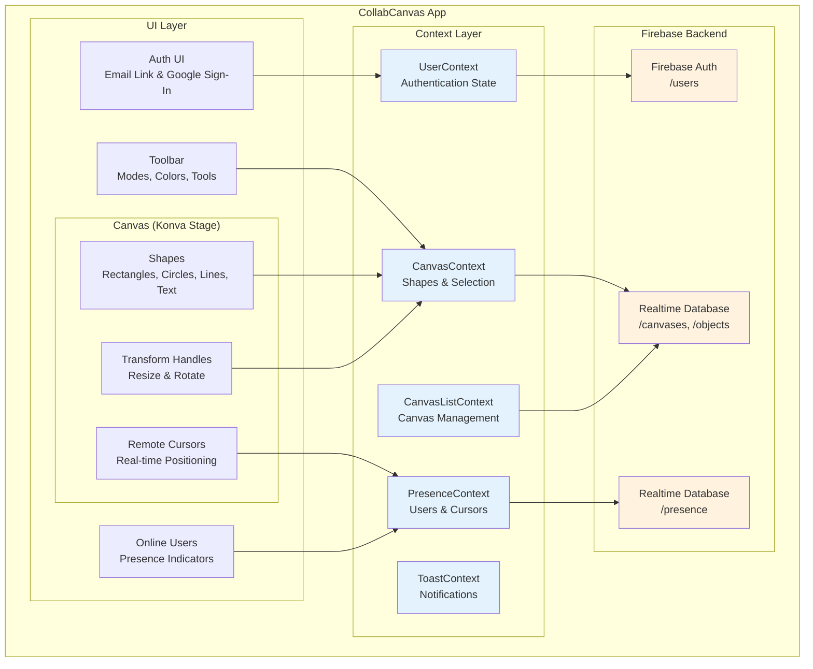

# CollabCanvas

[](https://www.typescriptlang.org/)
[](https://react.dev/)
[](https://firebase.google.com/)
[](https://vitejs.dev/)
[](LICENSE)

A real-time collaborative canvas application where multiple users can create, select, transform, and interact with multiple shape types together. Features export, copy/paste, lasso selection, multi-select transform, arrow key nudging, resize, rotate, and real-time synchronization. Built with React, TypeScript, Firebase, and Konva.

> **🚀 Live Demo**: [https://collab-canvas-2ba2e.web.app/](https://collab-canvas-2ba2e.web.app/)

## ✨ Features

- 🤖 **AI Canvas Agent**: Create and manipulate shapes using natural language commands powered by GPT-4
- 📋 **Multiple Canvases**: Create and manage unlimited canvases with organized list view
- 🔗 **URL-Based Sharing**: Share canvases instantly by copying the link - no invite system needed
- 🎨 **Real-time Collaboration**: See other users' changes instantly (<100ms sync)
- 🖱️ **Multiplayer Cursors**: View other users' cursor positions with name labels (<50ms updates)
- 🎨 **Multiple Modes**: Pan, Select, Lasso, Rectangle, Circle, Line, and Text creation modes
- 📦 **Multiple Shape Types**: Rectangles, circles, lines, and text with formatting options
- 🔲 **Multi-Select**: Select multiple shapes using 6 methods (click, Shift+click, drag-box, lasso, Ctrl/Cmd+A, Select mode)
- 🔄 **Transform Operations**: Resize and rotate shapes with intuitive handles and controls
- 📐 **Multi-Select Transform**: Scale multiple selected shapes together as a group with aspect ratio locking
- 📥 **Export to PNG**: High-quality canvas export with Cmd/Ctrl+E shortcut
- 📋 **Copy/Paste/Duplicate**: Standard clipboard operations (Cmd/Ctrl+C/V/X/D) with smart positioning
- ✨ **Lasso Selection**: Free-form selection tool for irregular shape groups
- ⌨️ **Arrow Key Nudging**: Precise 5px positioning with arrow keys
- 🎯 **Advanced Manipulation**: Move, delete, change colors, and adjust line thickness for single or multiple shapes
- 📐 **Smart View Control**: Auto-frame selected shapes or AI-generated content with smooth animations
- ↩️ **Undo/Redo**: Full history tracking with Ctrl/Cmd+Z/Y
- 👥 **Presence System**: See who's online with colored indicators per canvas
- 🔒 **Secure Authentication**: Email link and Google Sign-In support
- 📱 **Responsive Canvas**: Pan and zoom with smooth 60 FPS animations
- ⚡ **Optimized Performance**: Handles 100+ shapes with multiple concurrent users, optimized multi-select drag
- ⌨️ **Keyboard Shortcuts**: Quick access to all modes and operations (V, S, L, R, C, T, /, Ctrl/Cmd+A/C/V/X/D/E/Z/Y, Arrow keys)

## Tech Stack

- **Frontend**: React 19, TypeScript, Vite
- **Canvas**: Konva, React-Konva
- **Routing**: React Router DOM v7
- **Backend**: Firebase Realtime Database, Firebase Cloud Functions
- **AI**: OpenAI GPT-4 with Agents SDK (function calling)
- **Authentication**: Firebase Auth (Email Link & Google Sign-In)
- **Styling**: Tailwind CSS v4
- **Icons**: Lucide React
- **Testing**: Vitest, React Testing Library

## 🚀 Quick Start

**Prerequisites**: You need a Firebase project with Authentication, Realtime Database, and Hosting enabled. See [Prerequisites](#-prerequisites) section below.

```bash
# 1. Clone the repository
git clone <repository-url>
cd collab-canvas

# 2. Install dependencies (frontend and functions)
npm install
cd functions && npm install && cd ..

# 3. Set up Firebase project (see Setup Instructions section)
# - Create Firebase project
# - Enable Authentication, Realtime Database, and Hosting
# - Copy Firebase config

# 4. Create .env file with your Firebase credentials
cp .env.example .env
# Edit .env with your Firebase config

# 5. (Optional) Set up AI features - create functions/.env.local
# OPENAI_API_KEY=sk-your-key-here
# OPENAI_MODEL=gpt-4-turbo-preview

# 6. Apply Firebase security rules
firebase deploy --only database

# 7. Run development server
npm run dev

# 8. Open http://localhost:5173 in your browser
```

## 📋 Prerequisites

- Node.js (v18 or higher)
- npm or yarn
- Git (for version control)
- **Firebase Project** with the following services enabled:
  - **Authentication** (Email/Password and Google Sign-In)
  - **Realtime Database** (with security rules configured)
  - **Hosting** (for deployment)
  - **Functions** (optional, for AI features - requires Blaze plan)
  - Note: Free tier (Spark Plan) works for basic features, Blaze plan (pay-as-you-go) required for Cloud Functions
- **OpenAI API Account** (optional, for AI Canvas Agent features):
  - Required only if you want to use the AI assistant
  - Get your API key from [OpenAI Platform](https://platform.openai.com/api-keys)
  - Requires OpenAI account with credits ($5+ recommended for testing)

## 🏗️ Architecture Overview



### Data Flow
1. **User Actions** → Context (optimistic update) → Firebase
2. **Firebase Changes** → Context listeners → React state → UI update
3. **Real-time Sync**: Firebase broadcasts to all connected clients

### Key Technologies
- **React 19**: UI components and state management
- **TypeScript**: Type safety and better DX
- **Konva**: High-performance canvas rendering
- **Firebase Realtime DB**: Real-time data synchronization
- **Firebase Auth**: User authentication
- **Tailwind CSS v4**: Utility-first styling
- **Vite**: Fast build tool and dev server
- **Vitest**: Unit and integration testing

## 📦 Setup Instructions

### 1. Clone the Repository

```bash
git clone <repository-url>
cd collab-canvas
```

### 2. Install Dependencies

Install dependencies for both the frontend and Firebase Functions:

```bash
# Install frontend dependencies
npm install

# Install Firebase Functions dependencies
cd functions
npm install
cd ..
```

### 3. Firebase Configuration

**IMPORTANT**: You must have a Firebase project with Authentication, Realtime Database, and Hosting enabled.

1. Create a new Firebase project at [Firebase Console](https://console.firebase.google.com/)
2. Enable **Realtime Database**:
   - Go to Realtime Database in the Firebase console
   - Click "Create Database"
   - Start in test mode (you'll apply security rules next)
3. Enable **Authentication** methods:
   - Go to Authentication → Sign-in method
   - Enable **Email/Password** (for email link authentication)
   - Enable **Google Sign-In**
4. Enable **Hosting**:
   - Go to Hosting in the Firebase console
   - Click "Get Started" and follow the setup
5. Copy your Firebase configuration from Project Settings

### 4. Environment Variables

Create a `.env` file in the root directory with your Firebase credentials:

```env
VITE_FIREBASE_API_KEY=your_api_key
VITE_FIREBASE_AUTH_DOMAIN=your_project_id.firebaseapp.com
VITE_FIREBASE_DATABASE_URL=https://your_project_id.firebaseio.com
VITE_FIREBASE_PROJECT_ID=your_project_id
VITE_FIREBASE_STORAGE_BUCKET=your_project_id.appspot.com
VITE_FIREBASE_MESSAGING_SENDER_ID=your_sender_id
VITE_FIREBASE_APP_ID=your_app_id
```

**Note**: Never commit the `.env` file to version control! Use `.env.example` as a template.

### 5. Firebase Functions Environment Variables (Required for AI Features)

To use the AI Canvas Agent, you need to set up OpenAI API credentials for Firebase Functions:

Create a `functions/.env.local` file with your OpenAI API key:

```bash
# In the functions directory
cd functions
cat > .env.local << EOF
OPENAI_API_KEY=sk-your-openai-api-key-here
OPENAI_MODEL=gpt-4-turbo-preview
EOF
cd ..
```

Or manually create `functions/.env.local` with:

```env
OPENAI_API_KEY=sk-your-openai-api-key-here
OPENAI_MODEL=gpt-4-turbo-preview
```

**Where to get your OpenAI API key:**
1. Go to [OpenAI API Keys](https://platform.openai.com/api-keys)
2. Sign in or create an account
3. Click "Create new secret key"
4. Copy the key (starts with `sk-`)
5. Add it to `functions/.env.local`

**Note**: 
- Never commit `.env.local` to version control!
- This file is only for local development with Firebase emulators
- For production deployment, see the [Deploying AI Functions](#deploying-ai-functions) section below

### 6. Firebase Security Rules

The database security rules are defined in `database.rules.json` at the project root. To apply them:

**Option 1: Deploy via Firebase CLI** (recommended):
```bash
firebase deploy --only database
```

**Option 2: Manual setup via Firebase Console**:
1. Go to Firebase Console → Realtime Database → Rules
2. Copy the contents of `database.rules.json`
3. Paste into the Rules editor
4. Click "Publish"

### 7. Run the Development Server

**Option A: Without AI Features** (frontend only):
```bash
npm run dev
```

**Option B: With AI Features** (requires Firebase emulators):
```bash
# Terminal 1: Start Firebase emulators (with AI functions)
npm run emulators

# Terminal 2: Start frontend dev server
npm run dev
```

The app will be available at `http://localhost:5173`

**Note**: To use AI features locally, you must:
1. Have `functions/.env.local` configured with your OpenAI API key
2. Run the Firebase emulators (`npm run emulators`)
3. Set `VITE_USE_FUNCTIONS_EMULATOR=true` in your root `.env` file

## Development Scripts

### Frontend Scripts
```bash
npm run dev          # Start Vite dev server (frontend)
npm run build        # Build for production
npm run preview      # Preview production build
npm run test         # Run tests
npm run test -- --ui # Run tests with UI
npm run lint         # Run ESLint
```

### Firebase Functions Scripts
```bash
# From project root:
npm run emulators      # Start Firebase emulators (functions, auth, database)
npm run functions:dev  # Alias for emulators
npm run functions:build # Build Firebase Functions

# From functions/ directory:
cd functions
npm run dev            # Start Firebase emulators
npm run emulators      # Start Firebase emulators
npm run build          # Build TypeScript functions
npm run test:ai        # Run AI integration tests (watch mode)
npm run test:ai:run    # Run AI integration tests (single run)
```

### Running Full Local Development
To test AI features locally, you need both the frontend dev server AND Firebase emulators:

```bash
# Terminal 1: Start Firebase emulators
npm run emulators

# Terminal 2: Start frontend dev server
npm run dev
```

Then open `http://localhost:5173` and ensure your `.env` file has:
```
VITE_USE_FUNCTIONS_EMULATOR=true
```

## 🤖 AI Canvas Agent

The AI Canvas Agent is a powerful natural language interface that allows you to create and manipulate shapes using simple text commands.

### Features
- **Natural Language Commands**: Use GPT-4 to understand and execute canvas operations
- **14 AI Tools**: Create, move, resize, rotate, color, delete, arrange, align, and distribute shapes
- **Smart Positioning**: AI automatically positions shapes in your current viewport
- **Auto-Selection & Framing**: Created shapes are automatically selected and framed in view
- **Context-Aware**: AI understands your current canvas state, selected shapes, and color preferences

### Example Commands
- **Create**: "Create 3 blue rectangles in a row", "Add a red circle with radius 50"
- **Manipulate**: "Move the red rectangle to the center", "Make all circles twice as large"
- **Arrange**: "Arrange all shapes in a 3x3 grid", "Align selected shapes to the left"
- **Complex**: "Create a login form", "Build a navigation bar with 4 menu items"

### Local Development with AI Features

To develop and test AI features locally, you need both the frontend and Firebase emulators running:

```bash
# Terminal 1: Start Firebase Emulators
npm run emulators
# This starts Functions (5001), Auth (9099), Database (9000)

# Terminal 2: Start frontend dev server
npm run dev
# Open http://localhost:5173
```

**Requirements**:
1. Add your OpenAI API key to `functions/.env.local`:
   ```
   OPENAI_API_KEY=sk-...
   OPENAI_MODEL=gpt-4-turbo-preview
   ```
2. Ensure `.env` has emulator enabled:
   ```
   VITE_USE_FUNCTIONS_EMULATOR=true
   ```

### AI Architecture

The AI system uses a secure server-side architecture:
- **Client**: React UI with chat panel and tool execution
- **Server**: Firebase Cloud Functions with OpenAI GPT-4
- **Security**: API keys never exposed to client
- **Tools**: 14 structured functions for canvas operations
- **Performance**: Sub-2 second response time target (90%+ of commands)
- **Optimizations**: Batch Firebase writes for 10-50x faster multi-object operations

## Testing

### Frontend Tests
```bash
# Run all tests
npm test

# Run tests with coverage
npm test -- --coverage

# Run tests in watch mode
npm test -- --watch

# Run tests with UI
npm test -- --ui
```

### AI Agent Tests
```bash
# Navigate to functions directory
cd functions

# Run AI tool selection tests (requires OpenAI API key in functions/.env.local)
npm run test:ai:run

# Run tests in watch mode
npm run test:ai
```

**Test Coverage:**
- ✅ 20/20 AI tool selection tests passing (100%)
- ✅ Tests all 14 AI tools with various commands
- ✅ Validates batched creation, layouts, manipulations
- ✅ No Firebase emulators required
- 📄 See `functions/README_AI_TESTS.md` for details

## Project Structure

```
collab-canvas/
├── src/
│   ├── main.tsx                    # App entry point
│   ├── App.tsx                     # Root component
│   ├── config/
│   │   └── firebase.ts             # Firebase initialization
│   ├── contexts/
│   │   ├── UserContext.tsx         # Auth state management
│   │   ├── CanvasContext.tsx       # Canvas state management
│   │   └── PresenceContext.tsx     # Presence state management
│   ├── components/
│   │   ├── auth/                   # Authentication components
│   │   ├── canvas/                 # Canvas & shape components
│   │   ├── toolbar/                # Toolbar UI components
│   │   └── presence/               # Online users components
│   ├── hooks/                      # Custom React hooks
│   ├── types/                      # TypeScript type definitions
│   ├── utils/                      # Helper functions
│   └── styles/                     # Global styles
├── tests/                          # Test files
├── public/                         # Static assets
├── memory-bank/                    # Project documentation
├── .cursor/rules/                  # AI coding guidelines
├── .env.example                    # Environment variables template
└── package.json                    # Dependencies
```

## 📚 Documentation & Project Intelligence

### Memory Bank

The `memory-bank/` directory contains comprehensive project documentation that persists across development sessions:

- **`projectbrief.md`** - Project overview, requirements, and status
- **`productContext.md`** - User experience, problem-solving approach, and roadmap
- **`systemPatterns.md`** - Architecture decisions and design patterns
- **`techContext.md`** - Technology stack and development setup
- **`activeContext.md`** - Current work, recent changes, and open questions
- **`progress.md`** - Detailed feature checklist and completion status

**When to read:** Essential for understanding project context, especially when resuming work or onboarding new developers.

### Project Rules (.cursor/rules/)

AI-powered coding guidelines ensure consistent patterns across the codebase:

- **`base.mdc`** - Core project patterns and conventions
- **`firebase.mdc`** - Firebase-specific patterns (listeners, optimistic updates)
- **`react-components.mdc`** - React component patterns and best practices

**Purpose:** These rules guide AI assistants and developers to maintain code quality and consistency.

## How to Use

### Getting Started
1. **Sign In**: Use email link authentication or Google Sign-In
2. **Create Canvas**: Click "New Canvas" button and give it a name
3. **Share Canvas**: Copy the canvas URL from the menu to share with collaborators

### Canvas List
4. **Search Canvases**: Use the search bar to filter by name
5. **My Canvases**: View and manage canvases you created
6. **Shared With Me**: See canvases others have shared with you
7. **Canvas Actions**: Rename, copy link, or delete canvases you own

### Working on Canvas
8. **Switch Modes**: Toggle between different modes using toolbar or keyboard shortcuts
   - Press `V` for Pan mode (navigate canvas)
   - Press `S` for Select mode (drag-to-select box)
   - Press `L` for Lasso mode (free-form selection)
   - Press `R` for Rectangle mode
   - Press `C` for Circle mode
   - Press `/` for Line mode
   - Press `T` for Text mode
9. **Create Shapes**: Click and drag to create shapes (or click for text)
   - **Rectangles**: Drag from corner to corner
   - **Circles**: Drag from center outward
   - **Lines**: Drag from start point to end point
   - **Text**: Click to place, double-click to edit with formatting options
10. **Select Shapes**: Multiple ways to select
    - Click on a shape to select it
    - Shift+Click to add/remove from selection
    - Drag a selection box in Select mode (S key)
    - Draw a lasso around shapes in Lasso mode (L key)
    - Press Ctrl/Cmd+A to select all
11. **Transform Shapes**: Resize and rotate selected shapes
    - **Single Shape Resize**: Drag corner/edge handles
    - **Single Shape Rotate**: Drag rotation handle (rectangles, lines, text)
    - **Multi-Select Transform**: Scale multiple shapes together (corner handles only, aspect ratio locked)
    - Hold Shift to lock aspect ratio or disable angle snapping (single shapes)
12. **Position Shapes**: Move shapes precisely
    - **Drag**: Click and drag to move (supports multi-select)
    - **Arrow Keys**: Nudge 5 pixels (↑↓←→) with undo support
13. **Clipboard Operations**: Copy, paste, cut, and duplicate
    - **Copy**: Ctrl/Cmd+C or toolbar button
    - **Paste**: Ctrl/Cmd+V or toolbar button (pastes at viewport center)
    - **Cut**: Ctrl/Cmd+X (copy + delete)
    - **Duplicate**: Ctrl/Cmd+D or toolbar button (offset +50px)
14. **Export Canvas**: Save your work as PNG
    - Press Ctrl/Cmd+E or click Export button
    - High-quality PNG with timestamp filename
15. **Undo/Redo**: Full history tracking
    - **Undo**: Ctrl/Cmd+Z
    - **Redo**: Ctrl/Cmd+Y
16. **Customize Shapes**: Change colors and line thickness
    - Use color picker for any hex color
    - Adjust line thickness (1-24px) for lines
17. **Delete Shapes**: Select shapes and press Delete/Backspace or click Delete button
18. **Pan Canvas**: Drag canvas in Pan mode to move around the workspace
19. **Zoom Canvas**: Use mouse wheel to zoom in/out (0.1x to 5x)

### AI Assistant
20. **Open AI Assistant**: Click the sparkles icon (✨) in the top navigation
21. **Natural Language Commands**: Type commands like:
    - "Create 3 blue rectangles in a row"
    - "Make a traffic light with red, yellow, and green circles"
    - "Arrange all shapes in a 3x3 grid"
    - "Change selected shapes to purple"
22. **AI Tools**: The AI can create shapes, move them, resize, rotate, change colors, arrange in grids, align, distribute, and more
23. **Smart Defaults**: When you don't specify colors or line widths, the AI uses your currently selected color and stroke width
24. **Viewport-Aware**: AI creates shapes in the visible area you're looking at - pan/zoom to where you want them to appear
25. **Auto-Selection & Framing**: AI-created shapes are automatically selected and framed in view for immediate editing

### View Management
26. **Frame Selected Shapes**: Click the Frame Selected button (📐) in the toolbar to automatically zoom and center the view around your selected shapes
27. **Keyboard Shortcuts**: Complete reference:
    - **Modes**: V (Pan), S (Select Box), L (Lasso), R (Rectangle), C (Circle), / (Line), T (Text)
    - **Selection**: Ctrl/Cmd+A (Select All), Escape (Deselect)
    - **Clipboard**: Ctrl/Cmd+C (Copy), V (Paste), X (Cut), D (Duplicate)
    - **History**: Ctrl/Cmd+Z (Undo), Y (Redo)
    - **Canvas**: Ctrl/Cmd+E (Export)
    - **Position**: Arrow Keys (Nudge 5px)

### Collaboration
28. **See Collaborators**: View online users in the top-right corner
29. **See Cursors**: Watch other users' cursors move in real-time
30. **Real-time Sync**: All changes appear instantly for everyone (including AI-generated shapes)

## Features Details

### Canvas

- 5000x5000px workspace
- Programmatic pan and zoom with smooth animations
- 60 FPS performance target during all operations
- Grid background
- Auto-fit on load to center all shapes

### Shape Types

- **Rectangles**: Click-and-drag creation, 10×10px to 2000×2000px
- **Circles**: Center-to-edge creation, 5px to 1000px radius, corner-only resize
- **Lines**: Point-to-point creation, custom endpoint handles, 1-24px thickness
- **Text**: Click to place, double-click to edit, bold/italic/underline, 8-72pt font size
- All shapes support color customization with hex color picker
- Real-time synchronization (<100ms latency)

### Multi-Select & Transform

- **6 Selection Methods**: Click, Shift+click, drag-to-select box, lasso selection, Ctrl/Cmd+A, Select mode
- **Lasso Selection**: Free-form selection tool (L key) using point-in-polygon algorithm
- **Group Operations**: Move, delete, color change, line thickness, scale (for multiple selected shapes)
- **Multi-Select Transform**: Scale multiple shapes together with corner handles (aspect ratio locked)
- **Single Shape Resize**: Drag handles to resize (shape-specific behaviors)
- **Single Shape Rotate**: Center-based rotation with 15° angle snapping (rectangles, lines, text)
- **Arrow Key Nudging**: Precise 5px positioning with full undo/redo support
- **Clipboard Operations**: Copy (Cmd/Ctrl+C), Paste (Cmd/Ctrl+V), Cut (Cmd/Ctrl+X), Duplicate (Cmd/Ctrl+D)
- **Export to PNG**: High-quality canvas export with Cmd/Ctrl+E
- **Performance**: Optimized multi-select drag with ~99.9% reduction in Firebase writes, batch updates for paste/duplicate

### Multiplayer

- Real-time shape updates (<100ms)
- Cursor position sync (<50ms with throttling)
- Presence indicators with user emails
- Color assignment (cycles through 5 colors for 6+ users)
- Cursor auto-hide after 30 seconds of inactivity

### Performance

- Handles 100+ rectangles with 3 concurrent users
- Optimistic updates for instant feedback
- Throttled cursor updates (50ms)
- Efficient Firebase listeners

## Deployment

### Firebase Hosting

#### Prerequisites for Deployment

- Firebase CLI installed globally
- Firebase project created (same project used for Realtime Database and Authentication)
- Environment variables configured in Firebase Hosting (or use `.env` file for local builds)

#### Deployment Steps

1. **Install Firebase CLI** (if not already installed):
```bash
npm install -g firebase-tools
```

2. **Login to Firebase**:
```bash
firebase login
```

3. **Verify Firebase Configuration**:
   - Check that `.firebaserc` has your project ID
   - Ensure `firebase.json` has correct hosting settings
   - Verify `database.rules.json` contains the security rules (this file is deployed automatically with `firebase deploy`)

4. **Build the Production Bundle**:
```bash
npm run build
```
   - This creates a `dist/` folder with optimized assets
   - Ensure no TypeScript or build errors
   - Check that `dist/index.html` and assets are generated

5. **Deploy to Firebase**:
```bash
firebase deploy
```
   - Deploys both hosting and database rules
   - Returns your public URL (e.g., `https://your-project.web.app`)

6. **Deploy Only Hosting** (optional):
```bash
firebase deploy --only hosting
```

7. **Deploy Only Database Rules** (optional):
```bash
firebase deploy --only database
```

### Deploying AI Functions

To deploy Firebase Functions with AI capabilities, you need to set environment variables in production.

#### Setting Environment Variables for Production

**Option 1: Using Firebase CLI** (Recommended):

```bash
# Set the OpenAI API key for production
firebase functions:config:set openai.api_key="sk-your-openai-api-key-here"
firebase functions:config:set openai.model="gpt-4-turbo-preview"

# Verify the config is set
firebase functions:config:get

# Deploy functions with the new config
firebase deploy --only functions
```

**Option 2: Using Firebase Console**:

1. Go to [Firebase Console](https://console.firebase.google.com/)
2. Select your project
3. Navigate to **Functions** → **Configuration**
4. Add environment variables:
   - `OPENAI_API_KEY`: Your OpenAI API key
   - `OPENAI_MODEL`: `gpt-4-turbo-preview`

**Important Notes:**
- Environment variables in Firebase Functions use a different format than local `.env.local` files
- The Firebase CLI stores config as `openai.api_key` (dot notation) but your code should access it as `process.env.OPENAI_API_KEY`
- Make sure your `functions/src/ai/openai.ts` reads from the correct environment variable
- After setting config, you must redeploy functions: `firebase deploy --only functions`

#### Deploy Everything (Hosting + Database + Functions):

```bash
# Deploy all services at once
firebase deploy

# Or deploy specific services
firebase deploy --only hosting,database,functions
```

#### Post-Deployment Checklist

After deployment, verify the following:
- [ ] Visit the deployed URL and check if it loads
- [ ] Test authentication (both email link and Google Sign-In)
- [ ] Verify authorized domains in Firebase Console → Authentication → Settings → Authorized domains
- [ ] Test shape creation and real-time sync
- [ ] **Test AI Features** (if deployed):
  - [ ] Open AI assistant panel (✨ icon)
  - [ ] Try a simple command like "Create a blue rectangle"
  - [ ] Verify AI responds and creates shapes
  - [ ] Check Firebase Console → Functions → Logs for any errors
  - [ ] Verify environment variables are set correctly
- [ ] Open in multiple browsers/tabs to test multiplayer features
- [ ] Check browser console for any errors
- [ ] Test on different browsers (Chrome, Firefox, Safari)
- [ ] Verify Firebase security rules are active
- [ ] Check Firebase Console → Realtime Database for data structure

#### Environment Variables in Production

**Important**: Environment variables must be built into the production bundle. Make sure your `.env` file is present during the build step, or configure them in your CI/CD pipeline.

For Firebase Hosting, environment variables are baked into the build at compile time (Vite convention). There's no need to set them in Firebase Console.

## Testing the Deployed Application

### Complete Testing Checklist

After deployment, systematically test all features to ensure everything works in production:

#### 1. Authentication Testing
- [ ] **Email Link Authentication**
  - Visit the deployed URL
  - Enter an email address
  - Click "Send Login Link"
  - Check email inbox for login link
  - Click the link and verify successful login
  - Check that user appears in online users list

- [ ] **Google Sign-In**
  - Click "Sign in with Google"
  - Select Google account
  - Verify successful login
  - Check that user appears in online users list

- [ ] **Session Persistence**
  - Refresh the page
  - Verify user stays logged in
  - Clear browser cookies
  - Verify user is logged out

#### 2. Canvas Operations Testing
- [ ] **Rectangle Creation**
  - Click and drag on canvas to create a rectangle
  - Verify minimum size constraint (10×10px)
  - Try creating tiny rectangle (should be at least 10×10px)
  - Create large rectangle (test up to 2000×2000px limit)
  - Verify single clicks don't create rectangles

- [ ] **Color Selection**
  - Click each of the 5 colors in the palette
  - Create a rectangle with each color
  - Verify rectangle uses selected color

- [ ] **Rectangle Selection**
  - Click on a rectangle to select it
  - Verify selection border appears
  - Click on another rectangle
  - Verify only one rectangle is selected at a time
  - Click on empty canvas
  - Verify rectangle is deselected
  - Press Escape key
  - Verify rectangle is deselected

- [ ] **Rectangle Movement**
  - Select a rectangle
  - Drag it to a new position
  - Verify it moves smoothly
  - Try dragging unselected rectangle
  - Verify it cannot be dragged without selection

- [ ] **Rectangle Deletion**
  - Select a rectangle
  - Click the Delete button
  - Verify rectangle is removed
  - Select another rectangle
  - Press Delete key
  - Verify rectangle is removed
  - Select another rectangle
  - Press Backspace key
  - Verify rectangle is removed

#### 3. Pan and Zoom Testing
- [ ] **Pan Functionality**
  - Click and drag on empty canvas
  - Verify canvas pans smoothly
  - Pan to different areas of the 5000×5000px workspace
  - Verify grid moves with pan

- [ ] **Zoom Functionality**
  - Use mouse wheel to zoom in
  - Verify zoom is smooth (60 FPS)
  - Zoom to maximum (5x)
  - Verify zoom stops at limit
  - Zoom out to minimum (0.1x)
  - Verify zoom stops at limit
  - Verify zoom centers on cursor position

#### 4. Real-time Collaboration Testing
- [ ] **Multi-user Shape Creation**
  - Open the app in two different browsers/devices
  - Sign in as different users in each
  - Create a rectangle in browser 1
  - Verify it appears in browser 2 within 100ms
  - Create a rectangle in browser 2
  - Verify it appears in browser 1 within 100ms

- [ ] **Multi-user Shape Movement**
  - In browser 1, select and move a rectangle
  - Verify the movement syncs to browser 2 in <100ms
  - In browser 2, select and move a different rectangle
  - Verify the movement syncs to browser 1 in <100ms

- [ ] **Multi-user Shape Deletion**
  - In browser 1, delete a rectangle
  - Verify it disappears from browser 2
  - In browser 2, delete a rectangle
  - Verify it disappears from browser 1

#### 5. Presence System Testing
- [ ] **Online Users List**
  - Open app in browser 1
  - Verify user appears in online users list
  - Open app in browser 2 with different account
  - Verify both users appear in list
  - Verify each user has a colored indicator
  - Close browser 1
  - Verify user 1 disappears from browser 2's list
  - Open app in 6 different browsers/tabs
  - Verify colors cycle through the 5-color palette

- [ ] **Cursor Tracking**
  - Open app in two browsers
  - Move mouse in browser 1
  - Verify cursor appears in browser 2 with correct label
  - Verify cursor position updates smoothly (<50ms)
  - Verify cursor color matches user color
  - Stop moving mouse for 30+ seconds
  - Verify cursor disappears after inactivity timeout

#### 6. Performance Testing
- [ ] **Multiple Rectangles**
  - Create 50+ rectangles on the canvas
  - Verify canvas remains responsive
  - Pan and zoom with many rectangles
  - Verify smooth 60 FPS performance
  - Create 100+ rectangles
  - Test with 2-3 concurrent users
  - Verify no crashes or slowdowns

- [ ] **Rapid Interactions**
  - Quickly create multiple rectangles
  - Rapidly select and move rectangles
  - Verify no lag or missed updates
  - Verify optimistic updates feel instant

#### 7. Cross-browser Testing
Test in multiple browsers:
- [ ] Google Chrome (latest)
- [ ] Mozilla Firefox (latest)
- [ ] Safari (latest, if on Mac)
- [ ] Microsoft Edge (latest)

For each browser, verify:
- Authentication works
- Rectangle creation works
- Pan/zoom works smoothly
- Real-time sync works
- No console errors

#### 8. Security Testing
- [ ] **Database Rules**
  - Log out
  - Open browser dev tools → Network tab
  - Try to access Firebase database directly
  - Verify access is denied without authentication
  
- [ ] **Authenticated Access**
  - Log in
  - Check Network tab for Firebase requests
  - Verify authenticated requests succeed
  - Verify user can only write their own presence data

#### 9. Error Handling Testing
- [ ] **Network Interruption**
  - Open browser dev tools → Network tab
  - Enable network throttling or offline mode
  - Try to create/move rectangles
  - Disable offline mode
  - Verify changes sync when connection restored

- [ ] **Invalid Actions**
  - Try to drag unselected rectangles
  - Try to delete without selection
  - Verify graceful handling with no crashes

#### 10. UI/UX Testing
- [ ] **Visual Consistency**
  - Verify toolbar is positioned correctly
  - Verify online users list is visible
  - Verify colors are vibrant and distinct
  - Verify selection borders are clear
  - Verify cursor labels are readable

- [ ] **Responsive Behavior**
  - Test on different screen sizes
  - Verify UI elements scale appropriately
  - Verify canvas is usable on smaller screens

### Performance Metrics to Monitor

When testing, monitor these metrics:
- **Shape sync latency**: Should be <100ms
- **Cursor sync latency**: Should be <50ms  
- **Frame rate**: Should maintain 60 FPS during pan/zoom
- **Memory usage**: Should remain stable (no leaks)
- **Network requests**: Should be optimized (throttled cursor updates)

### Common Issues to Watch For

- Cursor positions not syncing correctly
- Rectangles appearing in wrong positions after zoom
- Selection state not clearing properly
- Online users list not updating
- Authentication redirects not working
- Console errors or warnings
- Memory leaks with long sessions
- Race conditions with rapid updates

## Known Limitations

- No permanent shape grouping (only temporary for operations)
- No layers/z-index control
- No import functionality (export is available)
- Single-line text only (no multi-line support)
- Basic mobile support (no touch gesture optimizations)
- Multi-select transform only scales (no rotation or non-uniform scaling)

## Deployment Information

### Production URL
Once deployed, your application will be available at:
- **Firebase Hosting URL**: `https://[your-project-id].web.app`
- **Custom Domain** (optional): `https://[your-project-id].firebaseapp.com`

To find your deployment URL:
1. Run `firebase deploy`
2. Look for the "Hosting URL" in the deployment output
3. Or visit Firebase Console → Hosting to see your live site

### Deployment History
You can view deployment history and rollback if needed:
```bash
firebase hosting:list        # List recent deployments
firebase hosting:rollback    # Rollback to previous version
```

### CI/CD Integration
For continuous deployment, consider integrating with:
- GitHub Actions
- GitLab CI
- CircleCI
- Other CI/CD platforms

Example GitHub Actions workflow:
```yaml
name: Deploy to Firebase Hosting
on:
  push:
    branches: [ main ]
jobs:
  deploy:
    runs-on: ubuntu-latest
    steps:
      - uses: actions/checkout@v2
      - name: Install dependencies
        run: npm install
      - name: Build
        run: npm run build
      - name: Deploy
        uses: FirebaseExtended/action-hosting-deploy@v0
        with:
          repoToken: '${{ secrets.GITHUB_TOKEN }}'
          firebaseServiceAccount: '${{ secrets.FIREBASE_SERVICE_ACCOUNT }}'
          channelId: live
          projectId: your-project-id
```

## Success Criteria

This project exceeds all MVP requirements and includes enhanced collaboration features:

### ✅ Core Features Implemented
- [x] User authentication (Email Link + Google Sign-In)
- [x] Real-time collaborative canvas (5000×5000px workspace)
- [x] Multiple shape types (rectangles, circles, lines, text)
- [x] Flexible color customization with hex color picker
- [x] Multi-select with 6 selection methods (including lasso)
- [x] Transform operations (resize, rotate, multi-select scaling)
- [x] Shape manipulation (selection, movement, deletion, color, line thickness, nudging)
- [x] Export to PNG with high quality (Cmd/Ctrl+E)
- [x] Copy/Paste/Cut/Duplicate operations (Cmd/Ctrl+C/V/X/D)
- [x] Lasso selection tool for free-form selection (L key)
- [x] Arrow key nudging for precise positioning (5px increments)
- [x] Undo/Redo with full history tracking (Cmd/Ctrl+Z/Y)
- [x] Pan and zoom with programmatic smooth animations (60 FPS)
- [x] Multiplayer cursor tracking with name labels
- [x] Online users presence system with colored indicators
- [x] Real-time synchronization across all users
- [x] Multiple canvases with URL-based sharing

### ✅ Technical Requirements Met
- [x] React 19 + TypeScript + Vite
- [x] Firebase Realtime Database for state sync
- [x] Firebase Authentication for security
- [x] Konva + React-Konva for canvas rendering
- [x] Tailwind CSS v4 for styling
- [x] Comprehensive test suite with Vitest

### ✅ Performance Targets Achieved
- [x] Shape updates sync in <100ms (optimistic updates)
- [x] Cursor updates sync in <50ms (throttled)
- [x] Canvas maintains 60 FPS during pan/zoom and transform operations
- [x] Handles 100+ shapes (all types) with 3 concurrent users
- [x] Multi-select drag optimized (~99.9% reduction in Firebase writes)
- [x] Real-time visual feedback with local offset tracking
- [x] React.memo optimization on all shape components
- [x] No crashes or memory leaks during testing

### ✅ Security & Data Integrity
- [x] Firebase security rules prevent unauthenticated access
- [x] Users can only modify their own presence data
- [x] All shape operations require authentication
- [x] Last-write-wins strategy for conflict resolution

### ✅ User Experience
- [x] Single clicks don't create shapes (drag required, except text)
- [x] Size constraints enforced for all shape types
- [x] Multiple selection methods for flexible workflow
- [x] Intuitive transform handles (shape-specific behaviors)
- [x] Keyboard shortcuts for efficient navigation
- [x] Visual selection feedback (borders and selection box)
- [x] Objects selectable in any mode (not restricted to Pan/Select)
- [x] Auto-deselect when switching to creation modes
- [x] Prevention of accidental selection after shape creation
- [x] User colors cycle through 5-color palette for 6+ users
- [x] Cursors auto-hide after 30 seconds of inactivity
- [x] Error boundaries catch and display errors gracefully
- [x] Loading states for async operations
- [x] Toast notifications for user feedback

## Future Enhancements

See the planning documents for potential features in future iterations:

### Phase 2 (Enhanced Collaboration)
- ✅ Multiple shape types (rectangles, circles, lines, text) - COMPLETED
- ✅ Multi-selection and transforms (resize, rotate) - COMPLETED
- ✅ Keyboard shortcuts for power users - COMPLETED
- ✅ Undo/redo functionality - COMPLETED
- ✅ Copy/paste operations - COMPLETED
- ✅ Export to PNG - COMPLETED
- ✅ Lasso selection tool - COMPLETED
- ✅ Multi-select transform (group scaling) - COMPLETED
- ✅ Arrow key nudging - COMPLETED
- Permanent shape grouping (logical groups that persist)

### Phase 3 (Advanced Features)
- Export to SVG/PDF (PNG already completed)
- Import images and SVG files
- Layers and z-index control
- Persistent named workspaces
- Comments and annotations
- Version history
- Multi-select rotation (currently only scaling supported)

### Phase 4 (Team Features)
- User permissions and roles
- Private/public workspaces
- Workspace templates
- Integration with other tools
- Real-time chat
- Activity feed

### Performance & Scalability
- Code splitting for faster initial load
- Service worker for offline support
- WebSocket fallback for better performance
- Optimized rendering for 1000+ shapes
- Server-side rendering for better SEO

## Troubleshooting

### Firebase Connection Issues

- **Problem**: Cannot connect to Firebase
  - Check that your `.env` file has correct Firebase credentials
  - Verify Firebase Realtime Database is enabled in Firebase Console
  - Check that security rules allow authenticated access
  - Ensure `VITE_FIREBASE_DATABASE_URL` is correct (should be `https://your-project.firebaseio.com`)

### Authentication Not Working

- **Problem**: Email link authentication fails
  - Verify Email/Password authentication is enabled in Firebase Console
  - Ensure authorized domains include your hosting domain
  - Check that action URL settings are correct
  - Verify email is stored in localStorage during link generation

- **Problem**: Google Sign-In fails
  - Verify Google Sign-In is enabled in Firebase Console
  - Check that OAuth consent screen is configured
  - Ensure authorized domains include your hosting domain
  - Check browser console for specific error messages

### Deployment Issues

- **Problem**: Build fails
  - Run `npm install` to ensure all dependencies are installed
  - Check for TypeScript errors: `npm run lint`
  - Verify all environment variables are set
  - Clear `dist/` folder and rebuild

- **Problem**: Deployed site shows blank page
  - Check browser console for errors
  - Verify `firebase.json` public directory is set to "dist"
  - Ensure build completed successfully before deploying
  - Check that environment variables are present during build

- **Problem**: Database rules not working
  - Ensure `database.rules.json` exists in project root
  - Run `firebase deploy --only database` to deploy rules from the file
  - Verify rules are applied in Firebase Console → Realtime Database → Rules
  - Test rules using the Rules playground in Firebase Console

### Performance Issues

- Try reducing the number of shapes on canvas
- Check browser console for errors
- Ensure you're using a modern browser (Chrome, Firefox, Safari)
- Disable browser extensions that might interfere with canvas rendering
- Check network tab for Firebase connection issues

### Real-time Sync Issues

- **Problem**: Changes not syncing between users
  - Check Firebase connection status
  - Verify both users are authenticated
  - Check browser console for Firebase errors
  - Ensure database rules allow read/write access
  - Try refreshing the page

- **Problem**: Cursor not appearing for other users
  - Verify presence system is working (check online users list)
  - Ensure cursor updates are being sent (check Network tab)
  - Check that throttling is not blocking updates
  - Verify cursors are rendered in the correct layer

### AI Functions Issues

- **Problem**: AI assistant not responding (local development)
  - Verify `functions/.env.local` exists and contains your OpenAI API key
  - Ensure Firebase emulators are running (`npm run emulators`)
  - Check that `VITE_USE_FUNCTIONS_EMULATOR=true` is set in your root `.env` file
  - Look for errors in the emulator logs
  - Verify you have `cd functions && npm install` to install function dependencies

- **Problem**: AI assistant not responding (production)
  - Check Firebase Console → Functions → Logs for errors
  - Verify environment variables are set:
    ```bash
    firebase functions:config:get
    ```
  - Ensure functions are deployed: `firebase deploy --only functions`
  - Check that your OpenAI API key is valid and has credits
  - Verify authorized domains include your hosting domain

- **Problem**: "Function not found" error
  - Ensure functions are deployed: `firebase deploy --only functions`
  - Check `functions/lib/index.js` was built correctly
  - Verify Firebase Functions is enabled in your Firebase project
  - Check Firebase Console → Functions to see if functions are listed

- **Problem**: OpenAI API errors
  - Verify your API key is correct and starts with `sk-`
  - Check your OpenAI account has available credits
  - Verify the model name is correct (`gpt-4-turbo-preview`)
  - Check OpenAI API status: https://status.openai.com/

## Contributing

This is an MVP project built for learning purposes. Contributions welcome!

1. Fork the repository
2. Create a feature branch
3. Make your changes
4. Write/update tests
5. Submit a pull request

## 📊 Project Status

- **Current Version**: v1.3-dev (AI Canvas Agent in development)
- **Status**: 🚧 Active Development
- **Last Updated**: October 19, 2025
- **Build Status**: ✅ Passing
- **Test Coverage**: >70%
- **Production URL**: [https://collab-canvas-2ba2e.web.app/](https://collab-canvas-2ba2e.web.app/) (v1.2)
- **Dev Branch**: `ai-assistant-and-ux-fixes`

### Completed Milestones
- ✅ PR #1: Project setup and configuration
- ✅ PR #2: Firebase configuration and security rules
- ✅ PR #3: Authentication system
- ✅ PR #4: Context providers setup
- ✅ PR #5: Basic canvas with pan/zoom
- ✅ PR #6: Toolbar UI components
- ✅ PR #7: Rectangle creation and selection
- ✅ PR #8: Rectangle movement and deletion
- ✅ PR #9: Firebase real-time sync for shapes
- ✅ PR #10: Multiplayer cursors
- ✅ PR #11: Presence system and online users
- ✅ PR #12: Integration testing and bug fixes
- ✅ PR #13: Deployment setup and documentation
- ✅ PR #13.1: Canvas mode switching (Pan vs Rectangle)
- ✅ PR #15: Canvas ownership & URL-based sharing
- ✅ Documentation: Memory Bank and project rules system
- ✅ Feature: Additional Shape Types (circles, lines, text with formatting)
- ✅ Feature: Multi-Select & Transform Operations (Priority #2)
  - Multi-select with 5 selection methods
  - Resize operations with shape-specific behaviors
  - Rotation with center-based origin and angle snapping
  - Performance optimizations for multi-object operations
  - UX enhancements (Pan mode, Select mode, keyboard shortcuts)
- ✅ Feature: Advanced Canvas Tools (Export, Copy/Paste, Lasso, Multi-Select Transform, Nudging)
  - Export canvas as high-quality PNG (Cmd/Ctrl+E)
  - Copy/Paste/Cut/Duplicate operations (Cmd/Ctrl+C/V/X/D)
  - Lasso selection tool for free-form selection (L key)
  - Multi-select transform with corner-only handles (aspect ratio locked)
  - Arrow key nudging for precise positioning (5px increments)
  - Undo/Redo support for all operations
  - Batch Firebase updates for performance
- 🚧 Feature: AI Canvas Agent (Priority #1) - IN PROGRESS
  - Firebase Cloud Functions backend with OpenAI GPT-4
  - 14 AI tools for canvas operations (creation, manipulation, layout, context)
  - Natural language interface with chat panel
  - Smart positioning and auto-framing
  - Sub-2 second response time target (90%+ commands)

## 📝 License

MIT License - feel free to use this project for learning and development.

## 🙏 Acknowledgments

- Built with [Vite](https://vitejs.dev/) - Next generation frontend tooling
- Canvas rendering with [Konva](https://konvajs.org/) - 2D canvas library
- Real-time backend by [Firebase](https://firebase.google.com/) - Platform for building web apps
- Styled with [Tailwind CSS](https://tailwindcss.com/) - Utility-first CSS framework
- Testing with [Vitest](https://vitest.dev/) - Blazing fast unit test framework

## 📞 Support & Contact

For issues, questions, or contributions:
- Open an issue on GitHub
- Check the troubleshooting section above
- Review the planning documents in `/planning` directory

---

**Built with ❤️ for collaborative creativity**
